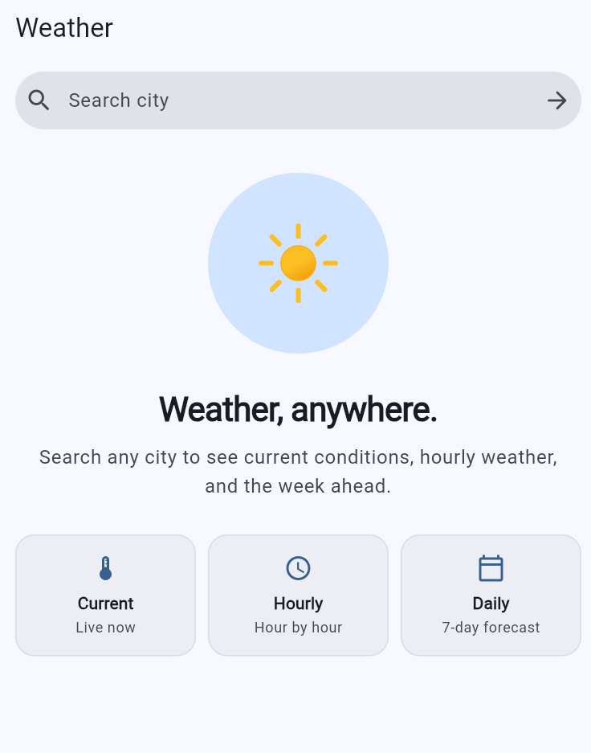
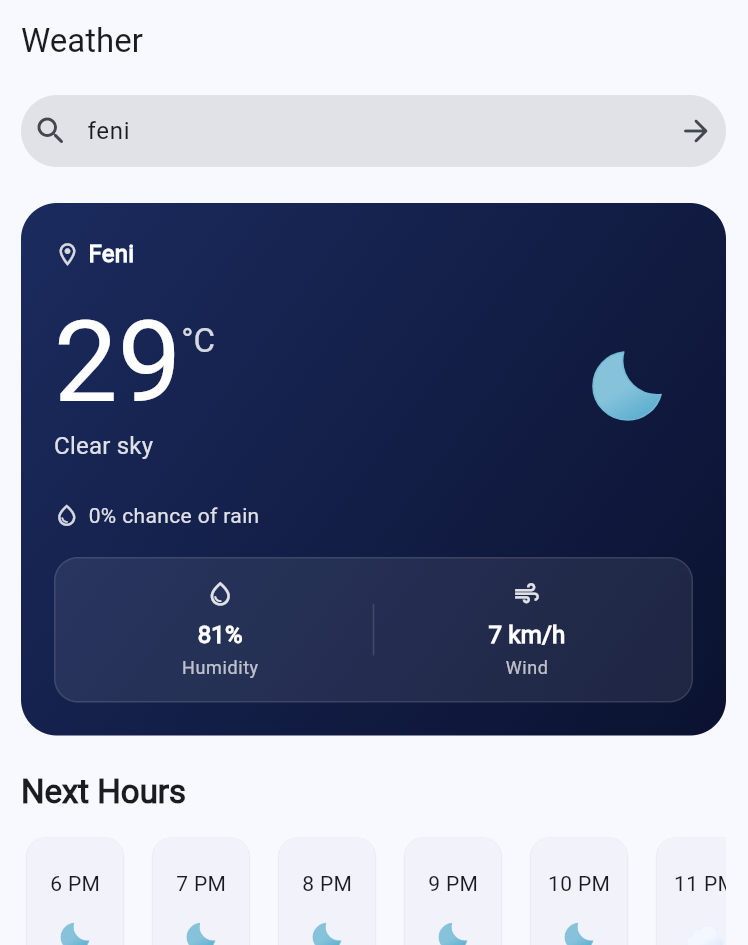
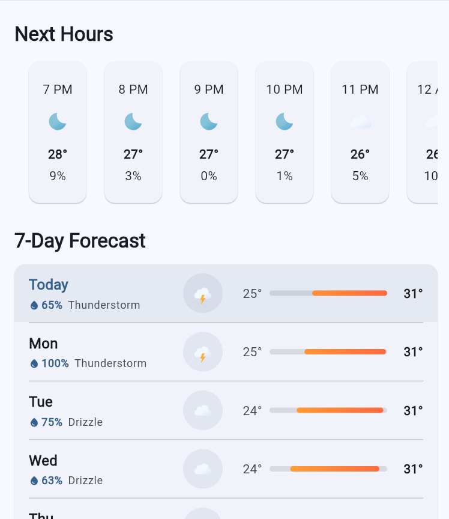
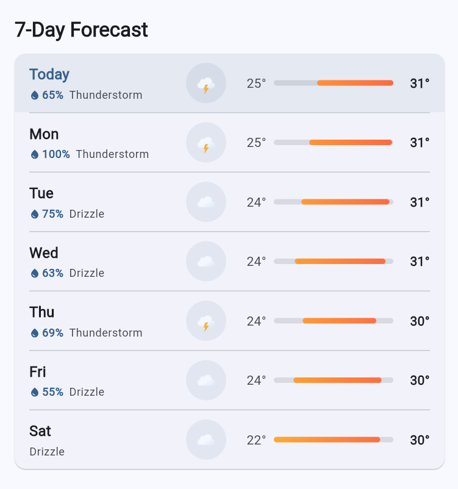

# Weather App

A simple weather application built with Flutter.
It uses the Open-Meteo API to show current weather, hourly forecast, and a 7-day forecast.

## Features

* Search weather by city
* Current temperature and weather condition
* Humidity and wind speed
* Precipitation probability
* Hourly forecast
* 7-day weather forecast
* Day and night weather icons
* Loading, error, and retry states
* Responsive UI

## Screenshots

<p align="center">
  
  
  
  
</p>

## Built With

* Flutter
* Dart
* REST API
* JSON
* HTTP
* Open-Meteo API

## Architecture

The project follows Clean Architecture.

```text
lib/
├── core/
│   ├── constants/
│   ├── error/
│   └── utils/
│
├── features/
│   └── weather/
│       ├── data/
│       ├── di/
│       ├── domain/
│       └── presentation/
│
└── main.dart
```

## API

This project uses the Open-Meteo API for weather data and geocoding.

* Weather data: Open-Meteo
* Location search: Open-Meteo Geocoding
* No API key required

## What I Practiced

* Flutter application structure
* Clean Architecture
* REST API integration
* JSON parsing
* Repository pattern
* Dependency injection
* Async programming
* Loading and error handling
* Responsive UI
* Git and GitHub

## Author

Mohib Ullah Foysal

GitHub: [MUfoysal](https://github.com/MUfoysal)
